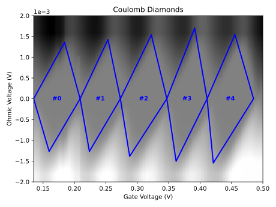

# Diamond Miner

Extract Coulomb diamond information from a provided measurement dataset.

## Installation

To install this to your already existing environment you can run the following commands in this directory,

```shell
(ENV) user ./diamondminer $ python setup.py bdist_wheel sdist
```
followed by installing it locally,
```shell
(ENV) user ./diamondminer $ python -m pip install . 
```

### Usage

Please see `demo.ipynb` for usage.

### Results



```text
Summary (#0):
====================
Left Vertex: [0.135 0.   ]
Top Vertex: [0.18432432 0.00135664]
Right Vertex: [0.20898649 0.        ]
Bottom Vertex: [ 0.15966216 -0.00126573]
Elementary Charge (e): 1.60218e-19 C
Permittivity of Free Space (ϵ0): 8.85419e-12 F/m
Relative Permittivity (ϵR): 11.70000
Width: 0.07399 V
Height: 0.00262 V
Lever Arm (α): 0.01772 eV/V
Addition Voltage: 0.07399 V
Charging Voltage: 0.00131 V
Total Capacitance: 122.19267 aF
Gate Capacitance: 2.16550 aF
Dot Size: 147.44178 nm

... and more ...
```
